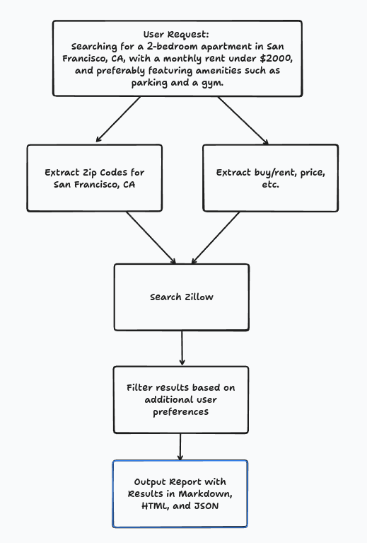

# Apify AI Agent Actor: Real Estate Search Assistant

## Overview
The **Real Estate Search Assistant** is an autonomous AI agent built on Apify that processes user requests for rental properties and generates a structured report. Given a user's input (e.g., "Searching for a 2-bedroom apartment in San Francisco, CA, with a monthly rent between $2000 and $4000, and preferably featuring amenities such as parking and a gym"), the agent extracts key criteria, searches relevant real estate listings, and outputs a multi-format report.

## Features
- **Autonomous Request Processing**: Understands user preferences from natural language input.
- **Asynchronous Web Scraping**: Fetches real-time rental listings from multiple sources efficiently.
- **AI-Powered Filtering**: Selects properties matching the specified criteria.
- **Multi-Format Reporting**: Outputs search results in Markdown, HTML, and JSON formats for flexibility.

## Workflow

1. **User Input Processing**: Extracts key search parameters such as location, budget, number of bedrooms, and amenities.
2. **Web Scraping**: Asynchronously scrapes real estate listing websites for matching properties.
3. **Data Filtering & Processing**: Sorts and filters listings based on relevance.
4. **Multi-Format Export**: Generates a comprehensive property report in Markdown (for readability), HTML (for web display), and JSON (for API integration).

## How to Use
1. Deploy the Apify AI agent on the Apify platform.
2. Provide a real estate search request as input.
3. The agent autonomously scrapes and processes listing data.
4. Retrieve the formatted property report in Markdown, HTML, or JSON.

## Example Input
```json
{
  "user_request": "Searching for a 2-bedroom apartment in San Francisco, CA, with a monthly rent between $2000 and $4000, and preferably featuring amenities such as parking and a gym."
}
```

## Example Output Format
### Be sure to check the "Storage > Key-value store output tab for the HTML/MD report files.

```json
{
  "markdown": "# Rental Listings in San Francisco, CA\n## 1. Modern 2-Bedroom Apartment\n- **Price**: $3,200/month\n- **Location**: Downtown SF\n- **Amenities**: Parking, Gym, Pool\n- [View Listing](example.com/listing1)",
  "html": "<h1>Rental Listings in San Francisco, CA</h1><h2>1. Modern 2-Bedroom Apartment</h2><ul><li><b>Price:</b> $3,200/month</li><li><b>Location:</b> Downtown SF</li><li><b>Amenities:</b> Parking, Gym, Pool</li><li><a href='example.com/listing1'>View Listing</a></li></ul>",
  "json": {
    "listings": [
      {
        "title": "Modern 2-Bedroom Apartment",
        "price": "$3,200/month",
        "location": "Downtown SF",
        "amenities": ["Parking", "Gym", "Pool"],
        "url": "example.com/listing1"
      }
    ]
  }
}
```

This AI agent autonomously handles real estate searches, making property hunting faster, easier, and more personalized!

